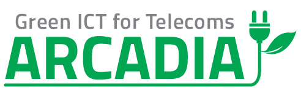
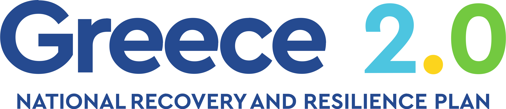

## The repo ARCADIA Project includes all the open-source code divided into the following folder:

    

- _images_: Project Images
- _Resource-demand-forecasting_: Code for the paper **Forecasting Resource Demand for Dynamic Datacenter Sizing in Telco Infrastructures** that train 4 machine Learning algorithms in a synthetic telco-based dataset to forecast the resource demands in a telco infrastructure. The paper was published in the IEEE Big Data 2023 conference at the 3rd International Workshop on Big Data Analytics for Sustainability (BDA4S)
- _Resource-demand-open-data_: Telco infrastructure workloads dataset with additional notebooks for visualization of the data

---

The ARCADIA project (code: T2EDK-02097) is financed by the European Union - NextGenerationEU program under the National Recovery and Resilience Plan "Greece 2.0" framework.

    

    

